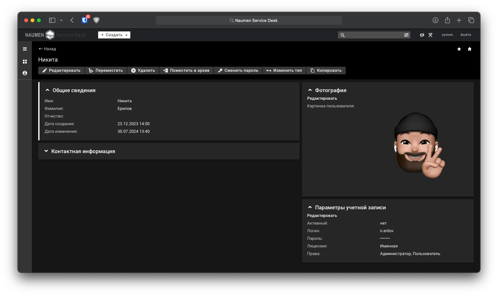
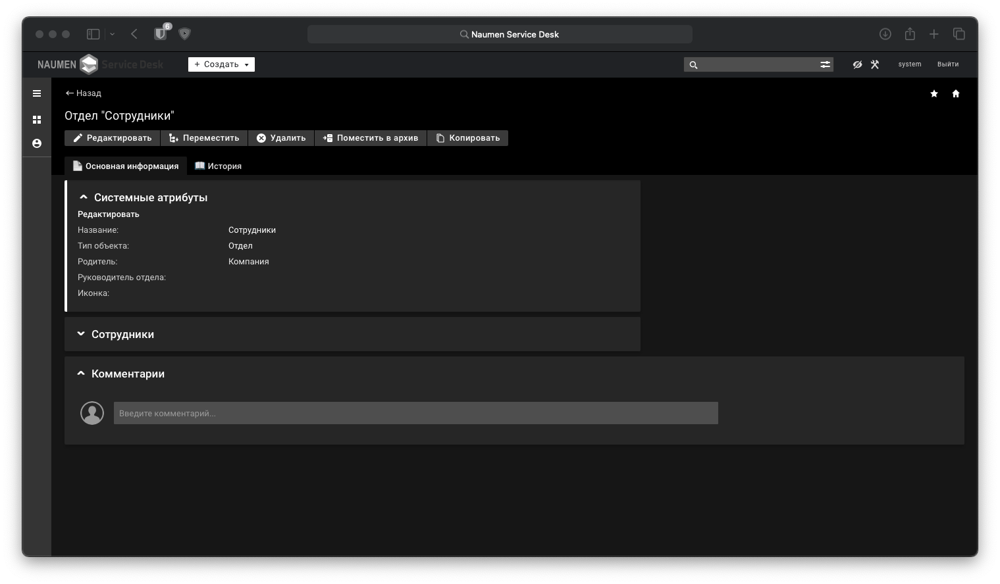

# Naumen Dark Theme
    

## Установка
> Все дейсвтия должны выполняться от имени суперпользователя
1. Переходим в режим технолога
1. Вкладка **Настройка системы** -> **Интерфейс и навигация**
1. Нажимаем на кнопку **+ Добавить тему**
1. Заполняем данные согластно файлу `metainfo.json`

## Обзор интерфеса

