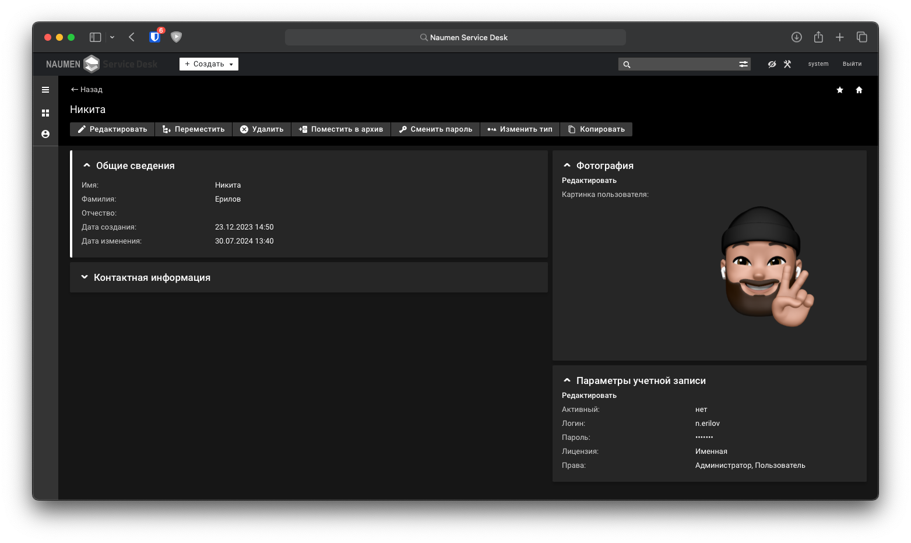
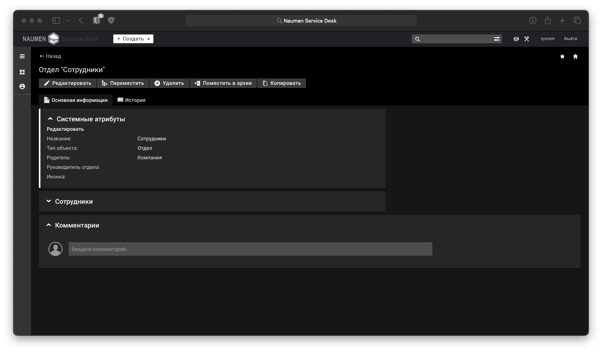

# Naumen Dark Theme
      

## Установка
> Все дейсвтия должны выполняться от имени суперпользователя
1. Переходим в режим технолога
1. Вкладка **Настройка системы** -> **Интерфейс и навигация**
1. Нажимаем на кнопку **+ Добавить тему**
1. Заполняем данные согластно файлу `metainfo.json`
1. При необходимости активируем тему для работы в режиме администратора

## Активация темы для режима администратора
```java
import ru.naumen.core.server.SpringContext
import ru.naumen.core.server.metastorage.impl.metainfo.MetaStorageService
import ru.naumen.core.shared.personalsettings.Theme
import ru.naumen.metainfo.server.MetainfoService

String themeCode = 'dark'

SpringContext context = SpringContext.getInstance()
MetaStorageService storage = context.getBean(MetaStorageService.class)
MetainfoService metainfo = context.getBean(MetainfoService.class)

Theme theme = storage.get('theme', themeCode)

if (theme == null) throw new IllegalStateException("Введено не корректное имя темы: ${themeCode}")

if (!theme.isDisplayedInAdminMode()) {
    theme.setDisplayedInAdminMode(true)
    storage.save(theme, 'theme', themeCode)
    metainfo.addTheme(theme)
}

return [
    code: theme.getCode(),
    displayedInAdminMode: theme.isDisplayedInAdminMode()
]
```

## Обзор интерфеса


